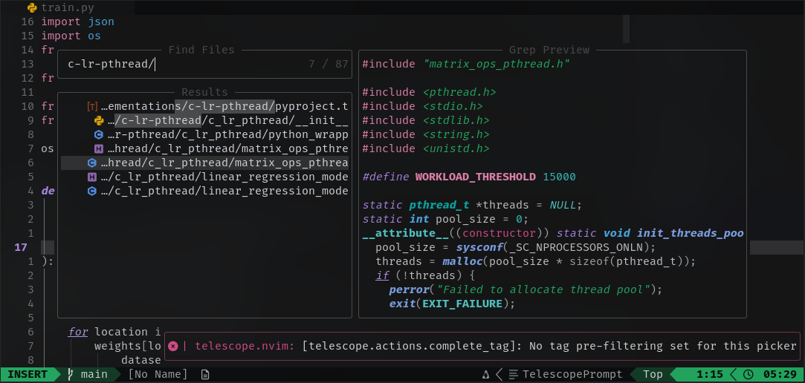

> My personal Neovim configuration — optimized for Python, web, and AI-related development.
> This repo mainly serves as a **personal backup**, but feel free to explore or get inspired!

---

## Overview

This config is built around **Neovim’s Lua-based setup**, focused on:

- **Speed:** Lazy-loaded plugins for snappy startup
- **Simplicity:** Clean structure, minimal bloat
- **Productivity:** Strong LSP, autocompletion, and formatter setup
- **Comfort:** Aesthetic UI + practical keymaps

It’s not meant to be a universal distro, just _my personal flow_ — but if you’re curious, you can clone and tweak it as you like.

---

## Components Used

- Plugin Manager : [Lazy](https://github.com/folke/lazy.nvim)
- File Explorer : [NeoTree](https://github.com/nvim-neo-tree/neo-tree.nvim)
- Fuzzy Finder : [Telescope](https://github.com/nvim-telescope/telescope.nvim)
- AI integration : [Windsurf](https://github.com/Exafunction/windsurf.nvim)
- Git Integration : [Gitsigns](https://github.com/lewis6991/gitsigns.nvim), [Neogit](https://github.com/TimUntersberger/neogit), [DiffView](https://github.com/sindrets/diffview.nvim),[Git Conflicts](https://github.com/akinsho/git-conflict.nvim)
- Auto Session : [AutoSession](https://github.com/rmagatti/auto-session)
- Bufferline : [Bufferline](https://github.com/akinsho/bufferline.nvim)
- ColorScheme : [NightFox](https://github.com/EdenEast/nightfox.nvim)
- Diagnostics : [Touble](https://github.com/folke/trouble.nvim)
- Flash : [Flash](https://github.com/folke/flash.nvim)
- Formatter : [Conform](https://github.com/stevearc/conform.nvim)
- LSP Tool Installer : [Mason](https://github.com/williamboman/mason.nvim), [Mason Tool Installer](https://github.com/williamboman/mason-tool-installer.nvim)
- LSP Config : [Nvim LSP](https://github.com/neovim/nvim-lspconfig), [Mason LSP Config](https://github.com/williamboman/mason-lspconfig.nvim)
- LSP File Operations : [Nvim LSP File Operations](https://github.com/nvim-lua/nvim-lsp-file-operations)
- Text Objects : [Mini AI](https://github.com/echasnovski/mini.ai)
- Spectre : [Spectre](https://github.com/nvim-pack/nvim-spectre)
- Status Line : [Lualine](https://github.com/nvim-lualine/lualine.nvim)
- Symbol Tree : [Aerial](https://github.com/stevearc/aerial.nvim)
- Syntax Highlighting: [Treesitter](https://github.com/nvim-treesitter/nvim-treesitter)
- Todo Comments Highlighting : [Todo Comments](https://github.com/folke/todo-comments.nvim)

There are some unmentioned components, you can definitely check the [plugins/](./lua/plugins/) folder!!

## Installation

You can just clone the repo and start neovim to let the magic happen:

```bash
git clone https://github.com/RakibulHasanRatul/nvim-config.git ~/.config/nvim
cd ~/.config/nvim
nvim
```

---

## Requirements

- **Neovim 0.11+**
- **Git**
- **Nerd Font** (for icons)
- _(Optional)_: Mason will handle most binary dependencies automatically — no system-wide installs needed 😉

---

## Highlights

- **Zero external dependencies** — everything runs inside the config dir
- **Tuned for terminal workflow** (no GUI dependencies)
- **Easily hackable**: Each module is self-contained and readable
- **Safe public config:** no personal API keys, secrets, or machine-specific paths

---

## Preview

Not much, showing preview from [my own source](https://github.com/RakibulHasanRatul/scratch-lrc)



---

## Note

This config evolves as I do — expect tweaks, rewrites, and experiments over time.
If you find something cool or notice an issue, feel free to open an issue or PR!

---

## License

MIT — do whatever you want with it. A star ⭐ would be appreciated if it helped you!
