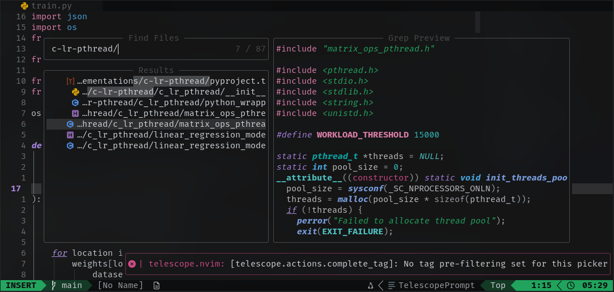

> My personal Neovim configuration — optimized for Python, web, and AI-related development.
> This repo mainly serves as a **personal backup**, but feel free to explore or get inspired!

---

## Overview

This config is built around **Neovim’s Lua-based setup**, focused on:

- **Speed:** Lazy-loaded plugins for snappy startup
- **Simplicity:** Clean structure, minimal bloat
- **Productivity:** Strong LSP, autocompletion, and formatter setup
- **Comfort:** Aesthetic UI + practical keymaps

It’s not meant to be a universal distro, just _my personal flow_ — but if you’re curious, you can clone and tweak it as you like.

---

## Components Used

- **AI Completion**: [copilot.vim](https://github.com/github/copilot.vim)
- **Auto Completion**: [blink.cmp](https://github.com/saghen/blink.cmp), [LuaSnip](https://github.com/L3MON4D3/LuaSnip), [friendly-snippets](https://github.com/rafamadriz/friendly-snippets)
- **Auto Pairs**: [mini.pairs](https://github.com/nvim-mini/mini.pairs)
- **Bufferline**: [bufferline.nvim](https://github.com/akinsho/bufferline.nvim)
- **Colorscheme**: [nightfox.nvim](https://github.com/EdenEast/nightfox.nvim)
- **Comment**: [mini.comment](https://github.com/nvim-mini/mini.comment), [nvim-ts-context-commentstring](https://github.com/JoosepAlviste/nvim-ts-context-commentstring)
- **Diagnostics**: [trouble.nvim](https://github.com/folke/trouble.nvim)
- **Emmet**: [emmet-vim](https://github.com/mattn/emmet-vim)
- **File Explorer**: [neo-tree.nvim](https://github.com/nvim-neo-tree/neo-tree.nvim), [plenary.nvim](https://github.com/nvim-lua/plenary.nvim), [nui.nvim](https://github.com/MunifTanjim/nui.nvim), [nvim-web-devicons](https://github.com/nvim-tree/nvim-web-devicons)
- **Format**: [conform.nvim](https://github.com/stevearc/conform.nvim)
- **Fuzzy Finder**: [telescope.nvim](https://github.com/nvim-telescope/telescope.nvim), [telescope-fzf-native.nvim](https://github.com/nvim-telescope/telescope-fzf-native.nvim)
- **Global Search/Replace**: [grug-far.nvim](https://github.com/MagicDuck/grug-far.nvim) - VS Code-like search and replace with file filtering
- **Git Integration**: [gitsigns.nvim](https://github.com/lewis6991/gitsigns.nvim), [lazygit.nvim](https://github.com/kdheepak/lazygit.nvim), [git-conflict.nvim](https://github.com/akinsho/git-conflict.nvim), [diffview.nvim](https://github.com/sindrets/diffview.nvim)
- **Icons**: [nvim-web-devicons](https://github.com/nvim-tree/nvim-web-devicons)
- **Indent Guides**: [indent-blankline.nvim](https://github.com/lukas-reineke/indent-blankline.nvim), [guess-indent.nvim](https://github.com/NMAC427/guess-indent.nvim)
- **Lazydev**: [lazydev.nvim](https://github.com/folke/lazydev.nvim)
- **LSP Config**: [nvim-lspconfig](https://github.com/neovim/nvim-lspconfig), [mason.nvim](https://github.com/williamboman/mason.nvim), [mason-lspconfig.nvim](https://github.com/williamboman/mason-lspconfig.nvim), [mason-tool-installer.nvim](https://github.com/WhoIsSethDaniel/mason-tool-installer.nvim), [fidget.nvim](https://github.com/j-hui/fidget.nvim), [blink.cmp](https://github.com/saghen/blink.cmp), [nvim-lsp-file-operations](https://github.com/antosha417/nvim-lsp-file-operations), [nvim-jdtls](https://github.com/mfussenegger/nvim-jdtls)
- **Match Tag**: [vim-matchtag](https://github.com/leafOfTree/vim-matchtag)
- **Navigation**: [mini.bracketed](https://github.com/nvim-mini/mini.bracketed)
- **Split Join**: [mini.splitjoin](https://github.com/nvim-mini/mini.splitjoin)
- **Statusline**: [lualine.nvim](https://github.com/nvim-lualine/lualine.nvim)
- **Styled Components**: [vim-styled-components](https://github.com/styled-components/vim-styled-components)
- **Surround**: [mini.surround](https://github.com/nvim-mini/mini.surround)
- **Symbol Tree**: [aerial.nvim](https://github.com/stevearc/aerial.nvim)
- **Syntax Highlighting**: [nvim-treesitter](https://github.com/nvim-treesitter/nvim-treesitter)
- **Text Objects**: [mini.ai](https://github.com/nvim-mini/mini.ai)
- **Todo Comments**: [todo-comments.nvim](https://github.com/folke/todo-comments.nvim),
- **TS Auto Tag**: [nvim-ts-autotag](https://github.com/windwp/nvim-ts-autotag)
- **UI Components**: [noice.nvim](https://github.com/folke/noice.nvim), [nui.nvim](https://github.com/MunifTanjim/nui.nvim), [snacks.nvim](https://github.com/folke/snacks.nvim), [telescope-ui-select.nvim](https://github.com/nvim-telescope/telescope-ui-select.nvim)
- **Undo Tree**: [undotree](https://github.com/mbbill/undotree)
- **Welcome Screen**: [alpha-nvim](https://github.com/goolord/alpha-nvim),
- **Which Key**: [which-key.nvim](https://github.com/folke/which-key.nvim)

## Installation

You can just clone the repo and start neovim to let the magic happen:

```bash
git clone https://github.com/RakibulHasanRatul/nvim-config.git ~/.config/nvim
cd ~/.config/nvim
nvim
```

---

## Requirements

- **Neovim 0.11+**
- **Git**
- **Nerd Font** (for icons)
- _(Optional)_: Mason will handle most binary dependencies automatically — no system-wide installs needed 😉

---

## Highlights

- **Zero external dependencies** — everything runs inside the config dir
- **Tuned for terminal workflow** (no GUI dependencies)
- **Easily hackable**: Each module is self-contained and readable
- **Safe public config:** no personal API keys, secrets, or machine-specific paths
- **VS Code-like search and replace**: Global search and replace with file filtering capabilities

---

## Preview

Not much, showing preview from [my own source](https://github.com/RakibulHasanRatul/scratch-lr)



---

## Search and Replace

This config includes multiple search and replace options for different use cases:

### **Advanced Search & Replace (grug-far.nvim)**
- **`<leader>sr`** - Global search and replace across project (VS Code-like interface)
- **`<leader>sw`** - Search and replace current word across project

Features:
- Live preview of changes
- File filtering with include/exclude patterns
- Regex support
- Multi-file operations
- Easy undo/redo

### **Built-in Search & Replace**
- **`<leader>fs`** - Simple word substitution in current file (Vim's `%s` command)

### **Telescope Search**
- **`<leader>fg`** - Live grep across project
- **`<leader>fw`** - Find word under cursor
- **`<leader>ff`** - Find files
- **`<leader>fb`** - Find buffers

## Note

This config evolves as I )o — expect tweaks, rewrites, and experiments over time.
If you find something cool or notice an issue, feel free to open an issue or PR!

---

## License

MIT — do whatever you want with it. A star ⭐ would be appreciated if it helped you!
